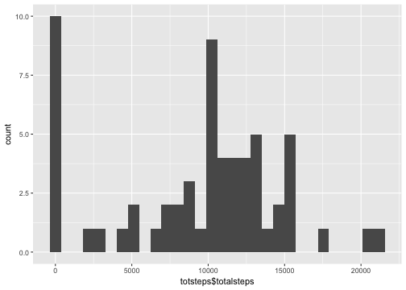
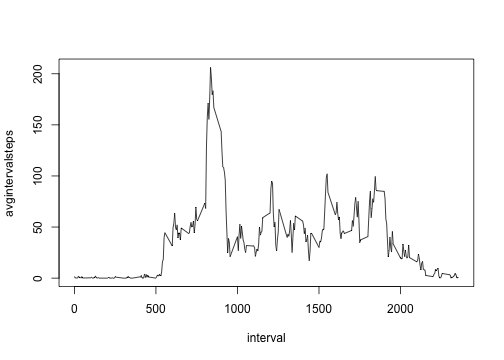
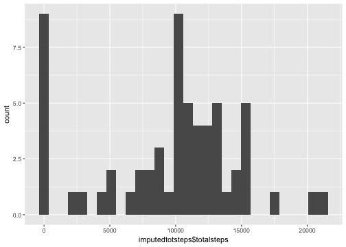
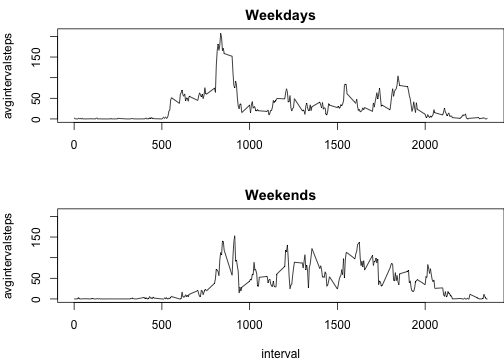

## Loading and preprocessing the data

<pre class="knitr r">activitydata &lt;- as.data.table(read.csv(&quot;/Users/danielstallworth/Downloads/activity.csv&quot;, na.strings = 'NA'))
head(activitydata)
</pre>

<pre class="knitr r">##    steps       date interval
## 1:    NA 2012-10-01        0
## 2:    NA 2012-10-01        5
## 3:    NA 2012-10-01       10
## 4:    NA 2012-10-01       15
## 5:    NA 2012-10-01       20
## 6:    NA 2012-10-01       25
</pre>

## What is mean total number of steps taken per day?  

### Steps taken per day histogram

<pre class="knitr r">totsteps &lt;- activitydata[,j=list(totalsteps=sum(steps,na.rm = T)),by = date]
qplot(x=totsteps$totalsteps) + geom_histogram(bins = 30)
</pre>

<pre class="knitr r">## `stat_bin()` using `bins = 30`. Pick better value with `binwidth`.
</pre>

### Mean of Steps per day

<pre class="knitr r">mean(totsteps$totalsteps,na.rm = T)
</pre>

<pre class="knitr r">## [1] 9354.23
</pre>

### Median of Steps per day

<pre class="knitr r">median(totsteps$totalsteps,na.rm = T)
</pre>

<pre class="knitr r">## [1] 10395
</pre>

## What is the average daily activity pattern?  

### Average steps per day interval

<pre class="knitr r">intervalstepsavg &lt;- activitydata[,j=list(avgintervalsteps=mean(steps,na.rm = T)), by = interval]
head(intervalstepsavg)
</pre>

<pre class="knitr r">##    interval avgintervalsteps
## 1:        0        1.7169811
## 2:        5        0.3396226
## 3:       10        0.1320755
## 4:       15        0.1509434
## 5:       20        0.0754717
## 6:       25        2.0943396
</pre>

<pre class="knitr r">with(intervalstepsavg, plot(interval, avgintervalsteps,type = &quot;l&quot;))
</pre>

### Max average interval steps

<pre class="knitr r">intervalstepsavg[avgintervalsteps == max(avgintervalsteps,na.rm = T)]
</pre>

<pre class="knitr r">##    interval avgintervalsteps
## 1:      835         206.1698
</pre>

## Imputing missing values  

### Count of missing values

<pre class="knitr r">sum(is.na(activitydata))
</pre>

<pre class="knitr r">## [1] 2304
</pre>

### Imputing missing values with the mean of the interval

<pre class="knitr r">imputedactivitydata &lt;- activitydata
# If na, set it to the mean steps for that interval which has already been computed in intervalstepsavg data table, so just look up the average value there and input into the missing value
imputedactivitydata$steps &lt;- ifelse(is.na(activitydata$steps) == T, intervalstepsavg$avgintervalsteps[activitydata$interval %in% intervalstepsavg$interval], activitydata$steps)
# If average value is still na set to 0
imputedactivitydata$steps[is.na(imputedactivitydata$steps)] &lt;- 0
# Get the total steps per day including imputed values and plot histogram
imputedtotsteps &lt;- imputedactivitydata[,j=list(totalsteps=sum(steps)),by = date]
qplot(x=imputedtotsteps$totalsteps) + geom_histogram(bins = 30)
</pre>

<pre class="knitr r">## `stat_bin()` using `bins = 30`. Pick better value with `binwidth`.
</pre>

### Mean of Imputed Steps per day

<pre class="knitr r">mean(imputedtotsteps$totalsteps)
</pre>

<pre class="knitr r">## [1] 9530.724
</pre>

### Median of Imputed Steps per day

<pre class="knitr r">median(imputedtotsteps$totalsteps)
</pre>

<pre class="knitr r">## [1] 10439
</pre>

Looks like the average total steps per day decreases slightly and the median total steps per day increases slightly.

## Are there differences in activity patterns between weekdays and weekends?  

### Creating Weekday variable and plot of average steps per interval for weekday vs weekend

<pre class="knitr r">imputedactivitydata$date &lt;- as.Date(imputedactivitydata$date)
weekenddays &lt;- c(&quot;Saturday&quot;,&quot;Sunday&quot;)
imputedactivitydata$weekday &lt;- imputedactivitydata[,j=list(weekday=factor((weekdays(date) %in% weekenddays), levels = c(T,F), labels=c('weekend', 'weekday')))]
head(imputedactivitydata)
</pre>

<pre class="knitr r">##        steps       date interval weekday
## 1: 1.7169811 2012-10-01        0 weekday
## 2: 0.3396226 2012-10-01        5 weekday
## 3: 0.1320755 2012-10-01       10 weekday
## 4: 0.1509434 2012-10-01       15 weekday
## 5: 0.0754717 2012-10-01       20 weekday
## 6: 2.0943396 2012-10-01       25 weekday
</pre>

<pre class="knitr r"># Average steps for interval by weekend vs weekday
imputedintervalstepsavg &lt;- imputedactivitydata[,j=list(avgintervalsteps=mean(steps)), by = list(weekday,interval)]
head(imputedintervalstepsavg)
</pre>

<pre class="knitr r">##    weekday interval avgintervalsteps
## 1: weekday        0       2.06037736
## 2: weekday        5       0.40754717
## 3: weekday       10       0.15849057
## 4: weekday       15       0.18113208
## 5: weekday       20       0.09056604
## 6: weekday       25       1.35765199
</pre>

<pre class="knitr r">par(mfrow=c(2,1),mar=c(4,4,2,0))
with(imputedintervalstepsavg[weekday == &quot;weekday&quot;], plot(interval, avgintervalsteps, main=&quot;Weekdays&quot;, type = &quot;l&quot;, xlab=&quot;&quot;, ylim = c(0,210)))
with(imputedintervalstepsavg[weekday == &quot;weekend&quot;], plot(interval, avgintervalsteps, main=&quot;Weekends&quot;, type = &quot;l&quot;, ylim = c(0,210)))
</pre>

